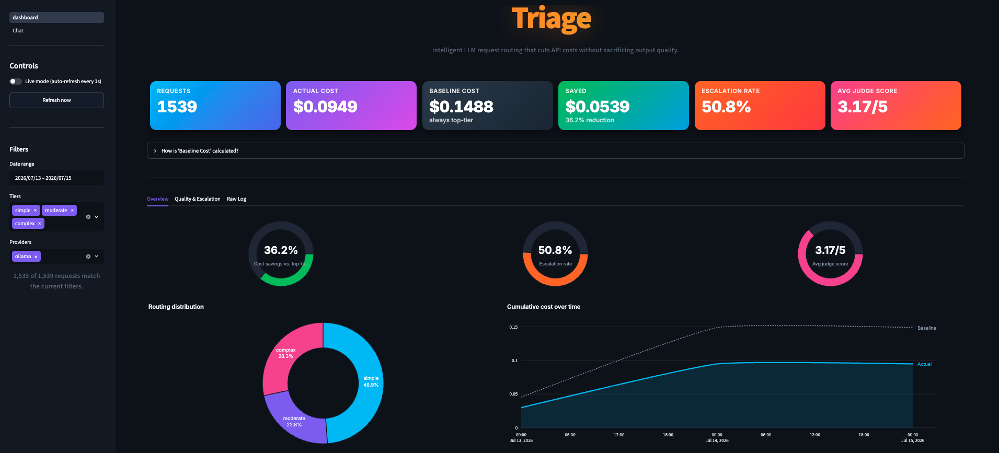
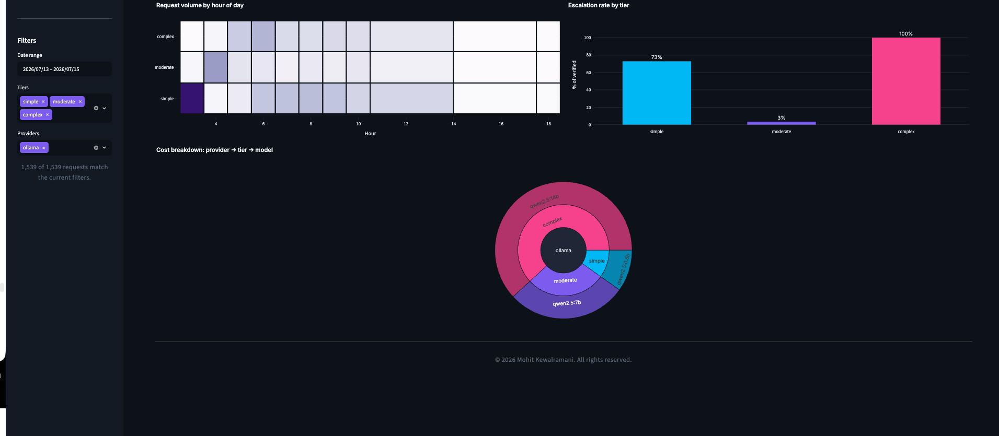
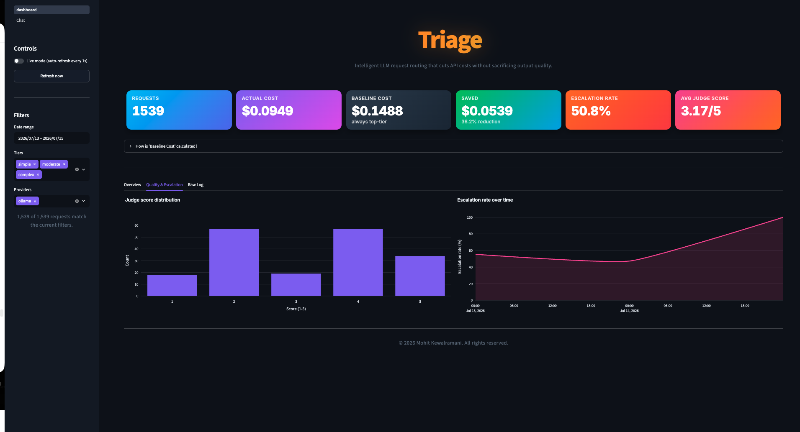
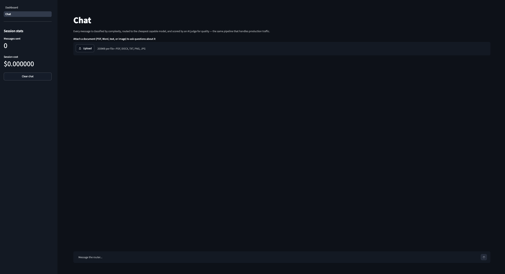
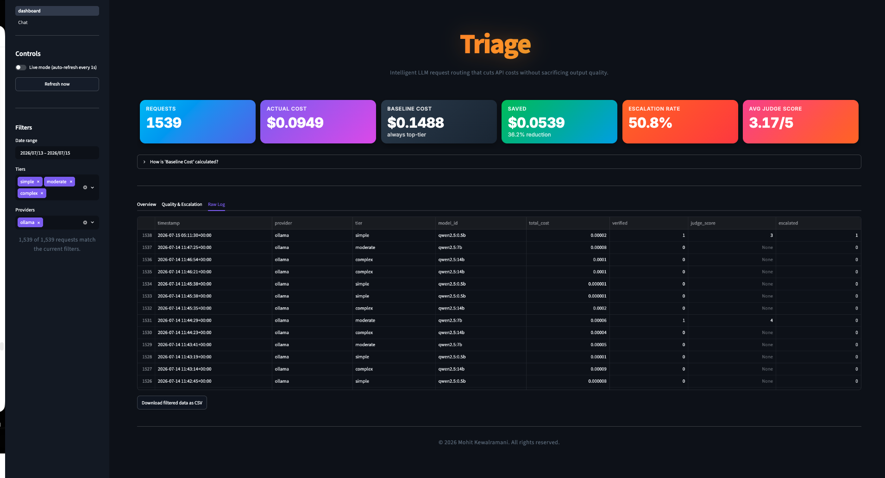

# Triage

An intelligent routing layer that sits in front of multiple LLM providers, scores each request's complexity, and routes it to the cheapest model capable of handling it at acceptable quality — with an async verification loop that catches bad routing decisions and automatically corrects them.

Runs fully free using local models via [Ollama](https://ollama.com) — no API keys required. Optional support for paid providers (OpenAI, Anthropic) via environment variables.



## What it does

Most apps that call LLM APIs send every request to a single model, usually the best one, because that's the simplest thing to build. A large share of real traffic doesn't need that: a factual lookup or a one-line rewrite doesn't require the same model as debugging a race condition.

Triage classifies each incoming prompt as **simple**, **moderate**, or **complex**, routes it to the cheapest capable model for that tier, and asynchronously re-checks a sample of responses with an LLM-as-judge. If a cheap-tier response scores too low, it's automatically re-run on the top-tier model before the user ever sees it — the miss is invisible to them, but it's logged and fed back into retraining the classifier.

Full write-up of the architecture, engineering decisions, and results: **[CASE_STUDY.md](CASE_STUDY.md)**.

## Results

Across 1,539 real requests (the original 501-prompt labeled dataset plus 1,000 entirely new prompts the classifier had never seen):

- **36.2% lower cost** than an always-use-the-best-model baseline ($0.0949 actual vs. $0.1488 baseline)
- Traffic split roughly **49% simple / 23% moderate / 28% complex**
- **3.17/5** average judge score on sampled responses, with automatic escalation catching the lower end of that distribution





## How it works

1. **Classify** — a scikit-learn classifier (94% held-out accuracy) scores complexity from extracted features: length, task-type keywords, constraint count, reasoning-depth signals.
2. **Route** — the cheapest available provider/model for that tier is selected. With no paid keys, everything runs on local Ollama. With one paid provider configured, it handles every tier. With both OpenAI and Anthropic configured, the router compares real per-token pricing per tier and can split traffic across providers if that's what's actually cheaper.
3. **Generate** — a unified client normalizes OpenAI, Anthropic, and Ollama responses into one schema (text, token counts, latency, cost).
4. **Verify** — a sample of responses is re-scored by an LLM-as-judge in a background thread; failures are automatically escalated to the top-tier model.
5. **Log and retrain** — every request is logged with a prompt *hash* (not raw text) for privacy. Escalated requests are the exception — their raw prompt feeds a flywheel script that retrains the classifier on real routing misses.

## Try it

**Dashboard** — cost, routing, and quality overview, reading live from the request log:

```
PYTHONPATH=. .venv/bin/streamlit run app/Dashboard.py
```

Includes a **Chat** page for talking to the router directly, with streaming responses, multi-turn context, and document upload (PDF, Word, images) with OCR text extraction.



**REST API** — `POST /v1/completions`, `GET /v1/models`, `GET /v1/stats`, `PUT /v1/routing-config`:

```
PYTHONPATH=. .venv/bin/uvicorn app.api:app --reload --port 8000
```

Or via Docker (reaches Ollama on your host machine automatically):

```
docker compose up --build
```

Full request log, filterable by date/tier/provider:



## Configuration

The app runs entirely free on local Ollama models with zero setup. To also enable paid providers:

1. Copy `.env.example` to `.env`.
2. Add your OpenAI and/or Anthropic API key(s).
3. Restart the app.

If only one paid provider has a key set, it's used for every request. If **both** are set, the router compares their price for each tier independently and routes to whichever is cheaper for that specific tier — so simple/moderate/complex requests can genuinely end up on different providers depending on real pricing, not a fixed preference order.

Model IDs and pricing for each provider live in `config/models.yaml` and `config/routing.yaml`. Provider model names change over time — if you see a "model not found" error from OpenAI or Anthropic, check their current model list and update those two files.

## Project structure

```
app/
  Dashboard.py      Streamlit dashboard (main entry point)
  pages/1_Chat.py   Chat interface with document upload + OCR
  api.py            FastAPI service (completions, models, stats, routing-config)
  router.py         Complexity-aware, per-tier cheapest-provider routing
  client.py         Unified request client for OpenAI / Anthropic / Ollama
  verifier.py       Async LLM-as-judge verification + escalation
  logger.py         Privacy-conscious request logging (SQLite)
  stats.py          Shared cost/savings aggregation (dashboard + API)
config/
  models.yaml       Model registry: pricing, latency, quality tier per model
  routing.yaml      Tier -> model mapping per provider
  verification.yaml Verification sampling rate and score threshold
scripts/
  train_classifier.py          Trains the complexity classifier
  simulate_savings.py          Estimates cost savings from routing decisions
  replay_traffic.py            Replays a CSV of prompts through the live pipeline
  generate_load_test_prompts.py Generates novel prompts for load testing
  flywheel_retrain.py          Retrains the classifier on escalated requests
```

## Stack

Python, FastAPI, scikit-learn, SQLite, Streamlit, Docker. OpenAI and Anthropic as optional paid providers; Ollama for a fully free, zero-API-key default.

---

© 2026 Mohit Kewalramani. All rights reserved.
